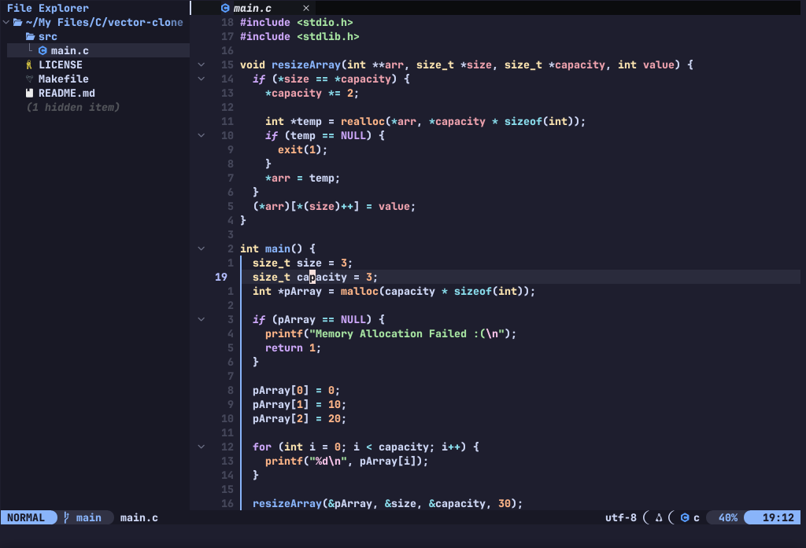
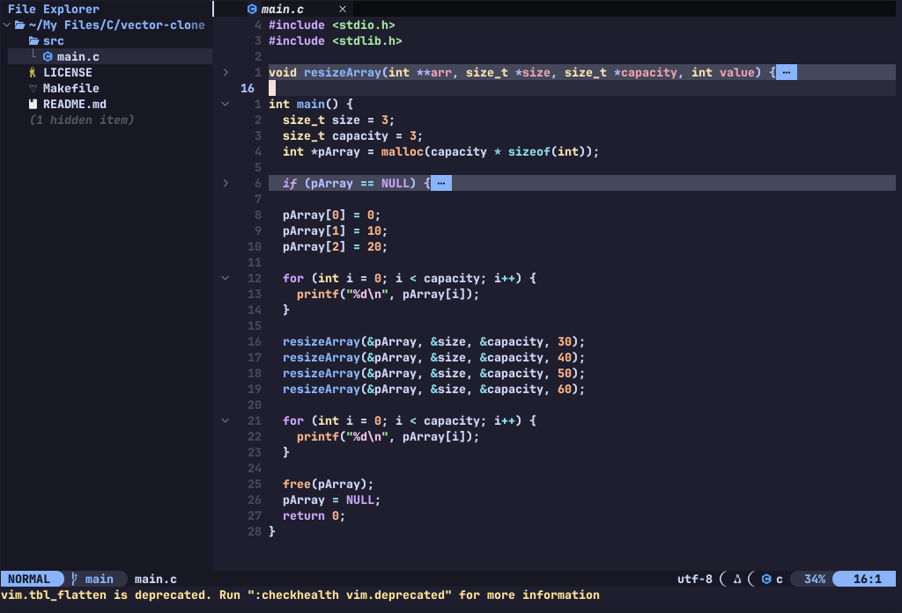

# NONEVIM

NONEVIM is my personal neovim configuration

---

## Features:

- Lightweight & Fast
- Pre Installed Plugins (Essential, and Quality of life plugins)
- LSP (Language Server Protocol Plugins)
- Code highlighting (via treesitter-nvim)
- Key Mappings for more efficient coding & writing
- Error, and Warning Diagnositcs
- Ability to fold code (via UFO)
- A real-time markdown renderer (via render-markdown)
- Rich UI (with neotree, lualine, catppuccin theme, and much more)

---

## Screenshot:




---

## Installation:

```bash
# Backup your exisiting config
mv ~/.config/nvim/ ~/.config/nvim-backup

# Clone this repositery
git clone https://github.com/nothingfr87/NONEVIM

# Move the repositery to your config directory
mv /path/to/repositer/ ~/.config/

# Remove unecessary files
cd ~/.config/nvim
rm -rf .git/ README.md screenshot*
```
