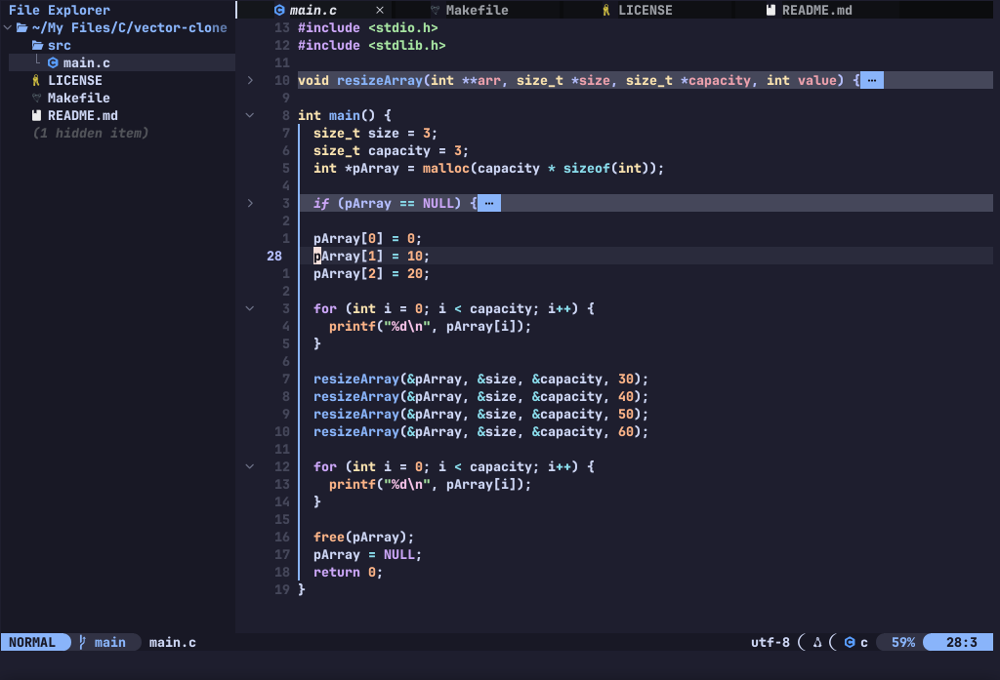

# NONEVIM

NONEVIM is my personal neovim configuration

---

## Features:

- Lightweight & Fast
- Pre Installed Plugins (Essential, and Quality of life plugins)
- LSP (Language Server Protocol Plugins)
- Code highlighting (via treesitter-nvim)
- Key Mappings for more efficient coding & writing
- Error, and Warning Diagnositcs
- Ability to fold code (via UFO)
- A real-time markdown renderer (via render-markdown)
- Rich UI (with neotree, lualine, catppuccin theme, and much more)

---

## Screenshot:




---

## Requirements

Before installing NONEVIM you need to have these things in order to install it

### System

| Program/Tool | Purpose |
| ------------ | ------- |
| Git | Cloning the repositery |
| GCC | Compiling native modules |
| CURL | Downloading extra resources (if needed) |
| make | Building plugin dependencies |

### Runtime (In Neovim)

| Program/Tool | Purpose |
| ------------ | ------- |
| ripgrep | For `live_grep` and `grep_sring` for telescope |
| fd | Finder (for telescope) |
| tree-sitter-cli | Treecitter CLI Interface (for nvim-treesitter) |

### LSP


| LSP | Purpose |
| --- | ------- |
| lua_ls | LUA LSP |
| pyright | Python LSP |
| clangd | C/C++ LSP |
| ts_ls | JS/TS LSP |
| html | HTML LSP |
| cssls | CSS LSP |
| emmet_ls | Emmet Extension-like on VSCode imported to Neovim |

---

### Formatter

| Formatter | Purpose |
| --------- | ------- |
| stylua | Lua Formatter |
| pretter | JS/TS, HTML, CSS Formatter |
| clang-format | C/C++ Formatter |
| autopep8 | Python Formatter |

---

## Installation:

```bash
# Backup your exisiting config
mv ~/.config/nvim/ ~/.config/nvim-backup

# Clone this repositery
git clone https://github.com/nothingfr87/NONEVIM

# Move the repositery to your config directory
mv /path/to/repositer/ ~/.config/

# Remove unecessary files
cd ~/.config/nvim
rm -rf .git/ README.md screenshot*
```

--- 

## Documentation:

[](https://nothingfr87.github.io/NONEVIM/)
